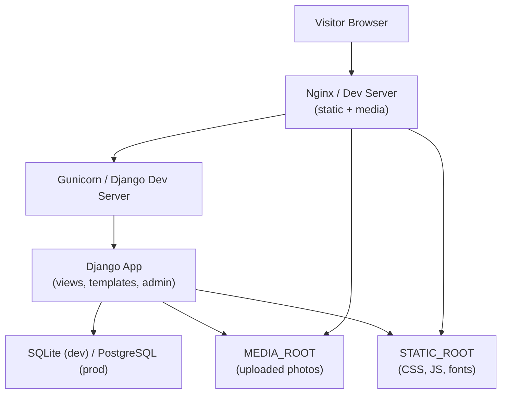

# Design Document

## Overview

A Django-based personal memory and tribute website that presents shared photos and memories through rich animations. The site is intentionally single-visitor (Ana) and single-owner (Mara), with all content managed via Django Admin. The frontend uses Bootstrap 5 for layout and custom CSS/JS for animations including a book-style page-flip gallery, typewriter hero text, and a decorative apology page.

The architecture is a classic Django monolith: server-rendered HTML templates, a small set of database models, and file-based media storage. No frontend framework (React/Vue) is needed — jQuery and vanilla JS handle the animation layer.

---

## Architecture



### Key Design Decisions

- **Django monolith over SPA**: Content is mostly static (owner uploads, visitor reads). Server-rendered templates are simpler, SEO-friendly, and require no API layer.
- **SQLite default / PostgreSQL production**: Keeps local setup dependency-free while supporting a managed production database.
- **Pillow for image processing**: Industry-standard Python imaging library; handles resize/compress on upload via a model `save()` override.
- **Bootstrap 5 + custom CSS**: Provides responsive grid and utility classes; book-flip and petal animations are custom CSS/JS rather than a heavy library to keep dependencies minimal.
- **python-decouple for environment variables**: Keeps secrets out of source code; `.env` file for local, OS env vars for production.

---

## Components and Interfaces

### URL Structure

| Route | View | Description |
|---|---|---|
| `/` | `HomeView` | Landing page with hero slideshow and typewriter |
| `/gallery/` | `GalleryView` | Animated photo gallery |
| `/apology/` | `ApologyView` | Apology page with decorative effects |
| `/admin/` | Django Admin | Content management |

### Django App Layout

```
project/
├── manage.py
├── requirements.txt
├── .env.example
├── config/                  # Django project settings package
│   ├── settings.py
│   ├── urls.py
│   └── wsgi.py
├── memories/                # Core Django app
│   ├── models.py
│   ├── views.py
│   ├── admin.py
│   ├── apps.py
│   ├── utils.py             # compress_image, validate_image_extension
│   └── migrations/
├── templates/
│   ├── base.html
│   ├── home.html
│   ├── gallery.html
│   └── apology.html
└── static/
    ├── css/
    │   ├── main.css
    │   ├── gallery.css
    │   └── apology.css
    └── js/
        ├── bookflip.js
        └── apology.js
```

### Views

**HomeView** (`TemplateView`)
- Queries `SiteSettings` for the welcome message
- Queries `Memory.objects.all()` ordered by `display_order` for the hero slideshow
- Context: `memories`, `welcome_message`

**GalleryView** (`TemplateView`)
- Queries all `Memory` objects ordered by `display_order`
- Groups memories into pairs for the book-page layout
- Context: `pages` (list of 2-item lists), `memories_json` (JSON for JS initialisation)

**ApologyView** (`TemplateView`)
- Queries `SiteSettings` for the apology message
- Context: `apology_message`

### Templates

- **base.html** — Bootstrap 5 CDN link, common `<head>`, navigation bar (Home / Gallery / Apology), ``, ``, ``.
- **gallery.html** — Book-flip container div; memories serialised via `{{ memories_json|json_script:"memories-data" }}`; `bookflip.js` reads that JSON to drive animation.
- **apology.html** — Full-screen layout; floating petal/heart elements injected by `apology.js`; message rendered via `{{ apology_message|safe }}`.
- **home.html** — Hero section with `` slideshow driven by CSS transitions; heading span targeted by `main.js` for typewriter effect.

### JavaScript Modules

| File | Purpose |
|---|---|
| `bookflip.js` | Reads `memories-data` JSON; renders left/right page panels; handles click/touch on next/prev controls; applies CSS `page-flip` class to trigger 3-D CSS perspective transform |
| `apology.js` | Creates and animates petal/heart DOM elements using `requestAnimationFrame`; respects `prefers-reduced-motion` media query |
| `main.js` | Typewriter effect on home page hero heading; hero slideshow auto-advance |

---

## Data Models

### Memory

```python
class Memory(models.Model):
    photo = models.ImageField(
        upload_to='memories/',
        validators=[validate_image_extension]
    )
    caption = models.CharField(max_length=300)
    date = models.DateField(null=True, blank=True)
    display_order = models.PositiveIntegerField(default=0, db_index=True)
    alt_text = models.CharField(
        max_length=200,
        default='',
        blank=True,
        help_text='Screen reader description of photo'
    )
    uploaded_at = models.DateTimeField(auto_now_add=True)

    class Meta:
        ordering = ['display_order']
        verbose_name_plural = 'Memories'

    def __str__(self):
        date_str = self.date.isoformat() if self.date else 'undated'
        return f'Memory #{self.display_order} — {date_str}'

    def save(self, *args, **kwargs):
        super().save(*args, **kwargs)
        if self.photo and os.path.exists(self.photo.path):
            compress_image(self.photo.path)
```

### SiteSettings (singleton)

```python
class SiteSettings(models.Model):
    welcome_message = models.TextField(
        default='Welcome to our memories.',
        help_text='Displayed on the home page hero section'
    )
    apology_message = models.TextField(
        default='',
        help_text='HTML-safe apology text. <p>, <em>, <br> supported.'
    )

    class Meta:
        verbose_name = 'Site Settings'
        verbose_name_plural = 'Site Settings'

    def save(self, *args, **kwargs):
        # Enforce singleton: always save to pk=1
        self.pk = 1
        super().save(*args, **kwargs)

    @classmethod
    def get(cls):
        obj, _ = cls.objects.get_or_create(pk=1)
        return obj
```

### Image Compression Utility

```python
# memories/utils.py
from PIL import Image
import os

MAX_FILE_SIZE_BYTES = 2 * 1024 * 1024   # 2 MB
MAX_DIMENSION = 1920                     # px — long edge cap

def compress_image(path: str) -> None:
    """Resize and re-save image in-place if it exceeds MAX_FILE_SIZE_BYTES."""
    if not os.path.exists(path):
        return
    if os.path.getsize(path) <= MAX_FILE_SIZE_BYTES:
        return
    with Image.open(path) as img:
        img = _resize_to_fit(img, MAX_DIMENSION)
        quality = 85
        while quality >= 40:
            img.save(path, optimize=True, quality=quality)
            if os.path.getsize(path) <= MAX_FILE_SIZE_BYTES:
                break
            quality -= 10


def _resize_to_fit(img: Image.Image, max_dim: int) -> Image.Image:
    w, h = img.size
    if max(w, h) <= max_dim:
        return img
    ratio = max_dim / max(w, h)
    return img.resize((int(w * ratio), int(h * ratio)), Image.LANCZOS)
```

### File Format Validation

```python
# memories/utils.py (continued)
from django.core.exceptions import ValidationError

ALLOWED_EXTENSIONS = {'.jpg', '.jpeg', '.png', '.gif', '.webp'}

def validate_image_extension(value):
    ext = os.path.splitext(value.name)[1].lower()
    if ext not in ALLOWED_EXTENSIONS:
        raise ValidationError(
            f'Unsupported file format "{ext}". '
            f'Allowed formats: JPEG, PNG, GIF, WebP.'
        )
```

### Admin Registration

```python
# memories/admin.py
@admin.register(Memory)
class MemoryAdmin(admin.ModelAdmin):
    list_display = ('display_order', 'caption', 'date', 'uploaded_at')
    list_editable = ('display_order',)
    ordering = ('display_order',)

@admin.register(SiteSettings)
class SiteSettingsAdmin(admin.ModelAdmin):
    def has_add_permission(self, request):
        return not SiteSettings.objects.exists()

    def has_delete_permission(self, request, obj=None):
        return False
```

---

## Correctness Properties

*A property is a characteristic or behavior that should hold true across all valid executions of a system — essentially, a formal statement about what the system should do. Properties serve as the bridge between human-readable specifications and machine-verifiable correctness guarantees.*

### Property 1: Image compression size bound

*For any* uploaded image whose file size exceeds 2 MB, after `compress_image` runs, the resulting file on disk SHALL have a size of at most 2 MB.

**Validates: Requirements 7.3, 7.4**

---

### Property 2: Image compression preserves image validity

*For any* uploaded image (JPEG, PNG, WebP), after `compress_image` runs, the resulting file SHALL still be openable as a valid image by Pillow without raising an exception.

**Validates: Requirements 7.3, 7.4**

---

### Property 3: Caption length enforcement

*For any* caption string of 300 characters or fewer, the `Memory` model SHALL accept the value; *for any* caption string whose length exceeds 300 characters, validation SHALL reject it.

**Validates: Requirements 2.1**

---

### Property 4: File extension validation

*For any* filename whose extension is in `{.jpg, .jpeg, .png, .gif, .webp}`, `validate_image_extension` SHALL not raise; *for any* filename whose extension is NOT in that set, it SHALL raise a `ValidationError` with a descriptive message.

**Validates: Requirements 5.6**

---

### Property 5: SiteSettings singleton and content round-trip

*For any* sequence of calls that save a welcome message or apology message to `SiteSettings`, there SHALL always be exactly one row in the `SiteSettings` table, and a subsequent `SiteSettings.get()` SHALL return the most-recently-saved values.

**Validates: Requirements 3.6, 4.5, 5.3, 5.4**

---

### Property 6: Memory display order is preserved on retrieval

*For any* collection of `Memory` objects assigned distinct `display_order` values, `Memory.objects.all()` SHALL return them sorted ascending by `display_order`.

**Validates: Requirements 5.2**

---

### Property 7: Rendered memory contains required fields

*For any* `Memory` object with a caption and optional date, the rendered gallery template HTML SHALL contain the caption text, the date (if present), and a non-empty `alt` attribute on the `` element.

**Validates: Requirements 2.3, 6.3**

---

## Error Handling

| Scenario | Handling |
|---|---|
| Photo fails to load in browser | `onerror` JS handler swaps `src` to a local placeholder SVG; CSS fallback via `::after` pseudo-element |
| Uploaded file has invalid extension | `validate_image_extension` raises `ValidationError`; Django Admin shows the message inline |
| Pillow cannot open a file | Exception caught in `compress_image`; original file is retained; error is logged via `logging.warning` |
| `SiteSettings` row missing on view render | `SiteSettings.get()` uses `get_or_create(pk=1)` — always returns a valid object with defaults |
| `MEDIA_ROOT` directory missing at startup | Django `FileSystemStorage` raises `IOError`; caught in view; returns 500; README documents `mkdir` step |
| Database unavailable | Standard Django 500 handler; health-check endpoint recommended for production monitoring |
| `DEBUG=False` with no `collectstatic` run | Missing static assets return 404; deployment README requires `python manage.py collectstatic` before start |
| `compress_image` cannot achieve ≤ 2 MB | Loop exits at quality=40; best-effort result is stored; caller logs a warning |

---

## Testing Strategy

### Property-Based Tests

The project uses **Hypothesis** (Python property-based testing library) configured at a minimum of **100 examples per property test** via `@settings(max_examples=100)`.

Each test is tagged with a comment referencing the design property it validates:

```
# Feature: girlfriend-memory-website, Property N: <property text>
```

Properties mapped to Hypothesis tests:

| Property | Test focus |
|---|---|
| 1 — Compression size bound | Generate real PIL images of random sizes/types above 2 MB; assert `os.path.getsize(path) <= MAX_FILE_SIZE_BYTES` after `compress_image` |
| 2 — Compression preserves validity | Same generators; assert `Image.open(path)` does not raise |
| 3 — Caption length enforcement | Generate strings with `st.text()`; assert `Memory.full_clean()` accepts ≤ 300 and raises `ValidationError` for > 300 |
| 4 — Extension validation | Generate filenames from valid/invalid extension pools; assert correct accept/reject behaviour |
| 5 — SiteSettings singleton | Generate sequences of `(welcome_msg, apology_msg)` pairs; call `save()` for each; assert `SiteSettings.objects.count() == 1` and final values match |
| 6 — Ordering invariant | Generate random lists of `display_order` integers; create `Memory` objects; assert queryset order equals sorted order |
| 7 — Rendered memory completeness | Generate `Memory` objects with arbitrary captions, dates, and alt text; render template; assert caption, date, and `alt` are present in HTML |

### Unit Tests

Focused on pure logic and deterministic cases:

- `compress_image`: images below 2 MB are unchanged; images at exactly 2 MB are unchanged; images above 2 MB are compressed
- `_resize_to_fit`: images smaller than `MAX_DIMENSION` are returned unchanged; wide/tall images are scaled correctly
- `validate_image_extension`: each allowed extension is accepted; common invalid extensions (`.txt`, `.pdf`, `.exe`) are rejected
- `SiteSettings.get()`: creates the singleton on first call; returns the same object on second call
- `Memory.__str__`: returns expected format with date and without date
- `Memory.Meta.ordering`: default queryset is ordered by `display_order`

### Integration Tests

- Admin upload flow: POST a valid JPEG to admin upload; assert file exists in `MEDIA_ROOT` and `Memory` row is in DB
- Admin validation: POST a `.txt` file; assert 200 with form error, no `Memory` row created
- Gallery view: `GET /gallery/` → HTTP 200; `memories` in context; template renders `` tags
- Apology view: `GET /apology/` → HTTP 200; `apology_message` in context
- Home view: `GET /` → HTTP 200; `welcome_message` in context; hero section present
- SiteSettings admin update: update welcome message via admin; verify home page reflects change

### Accessibility / Manual Verification

- Lighthouse accessibility score ≥ 80 run via Chrome DevTools or `lighthouse` CLI on Home, Gallery, and Apology pages
- Keyboard navigation: tab through all nav links and gallery controls; verify visible focus ring
- Screen reader: `axe` browser extension scan for missing `alt` attributes and ARIA violations
- Responsive layout: Chrome DevTools device emulation at 320 px, 768 px, 1024 px, 1440 px
